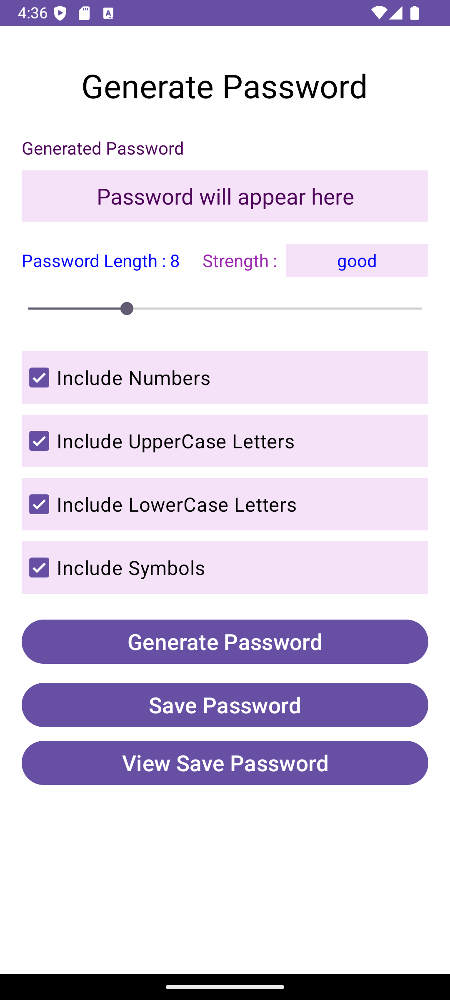

# 🔐 Password Generator App - Android (Java)

A modern and secure Android application built using Java to generate strong, customizable passwords. The app allows users to choose their desired password length and character combinations, displays password strength, and securely saves passwords using SharedPreferences for future reference.

---

## 📱 Features

- ✅ Generate random passwords of length **4 to 20 characters**
- 🔢 Customize with:
  - Numbers (0-9)
  - Uppercase letters (A-Z)
  - Lowercase letters (a-z)
  - Symbols (!@#$%^&*, etc.)
- 🧠 Password strength indicator:
  - **4-7 characters** → Weak 🔴
  - **8-9 characters** → Good 🔵
  - **10-11 characters** → Strong 🔵
  - **12-20 characters** → Very Strong 🟢
- 💾 Save generated passwords using **SharedPreferences**
- 👁️ View saved passwords later in the app

---

## 📸 Screenshots

|  |  |  |  |
|-------------------|--------------------|------------------|----------|

---

## 🎥 Demo Video

Watch a complete demo of the Password Generator app in action:


[](screenshots_video/Screen_recording_1pg.mp4)

---

## 🚀 Getting Started

### Installation

1. Clone the repository:

   ```bash
   git clone https://github.com/your-username/password-generator-app.git
   ```

2. Open the project in **Android Studio**.
3. Build and run the app on an emulator or physical Android device.

---

## 🛠 Tech Stack

| Technology         | Description                               |
|--------------------|-------------------------------------------|
| 💻 Java             | Core programming language                 |
| 📱 Android SDK      | Android platform for building applications |
| 📦 SharedPreferences| Local storage solution for Android        |
| 🎨 XML Layouts      | Used for designing the app UI             |
| 🧩 Material Design  | Provides a modern and user-friendly UI    |

---

---

## 🔐 Security Note

This app is designed for **educational purposes only**. Storing passwords in SharedPreferences is **not secure** for production-level applications. For real-world use, consider using encryption or the **Android Keystore system**.

---

## 🤝 Contributing

Contributions are welcome! Feel free to fork the repository, open issues, or submit pull requests to improve the project.

---

## 👤 Author

**Jigar**  
🌐 GitHub: [JigarPrajapati-21](https://github.com/JigarPrajapati-21)

---

## 📄 License

This project is licensed under the **MIT License**.  
See the [LICENSE](LICENSE) file for details.

---